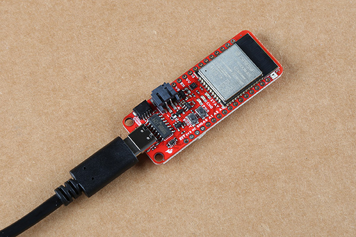
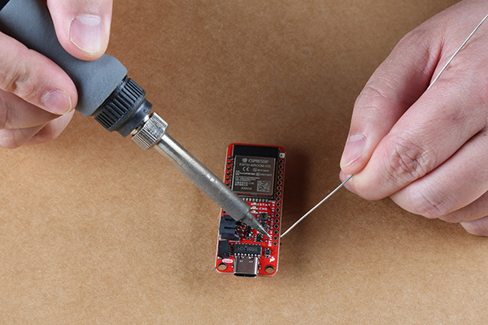
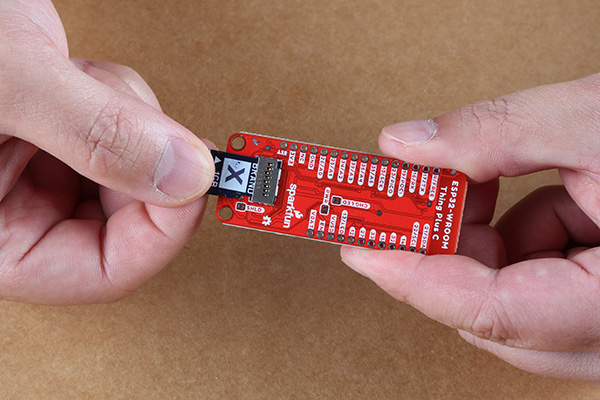
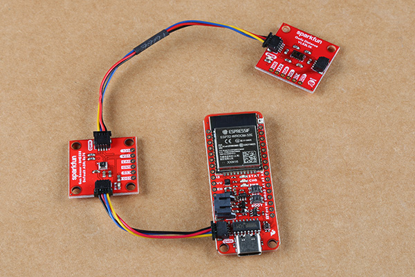

## USB Programming
The USB connection is utilized for programming and serial communication. Users only need to plug their ESP32-WROOM Thing Plus into a computer using a USB-C cable.

[{ width="400" }](./img/hookup_guide/assembly_usb.jpg) 
*The ESP32-WROOM Thing Plus with USB-C cable attached. (Click to enlarge)*

## Battery
For remote IoT applications, a Li-Po battery can be connected. Additionally, users may be interested in utilizing a [solar panel](https://www.sparkfun.com/products/16835) and [USB-C cable](https://www.sparkfun.com/products/14743) to recharge their battery.

<table style="border-style:none">
    <tr>
        <td align="center" width="50%">
            
             
            <i>The ESP32-WROOM Thing Plus with a battery connected. (Click to enlarge)</i>
        </td>
        <td align="center">
            <a class="thumb" href="https://www.sparkfun.com/products/16835">
                

                

                <h3 class="title">Solar Panel Charger - 10W</h3>
            </a>
            TOL-16835
        </td>
        <td align="center">
            <a class="thumb" href="https://www.sparkfun.com/products/14743">
                

                

                <h3 class="title">USB 3.1 Cable A to C - 3 Foot</h3>
            </a>
            TOL-14743
        </td>
    </tr>
</table>

!!! note
    
<b>DO <u>NOT</u></b> remove batteries by pulling on their wires. Instead, it is recommended that pair of dikes (i.e. diagonal wire cutters), pliers, or tweezers be used to pull on the JST connector housing, to avoid damaging the battery wiring.

    

        
         
        <i>Using a pair of dikes to disconnect a battery. (Click to enlarge)</i>
    

## Headers
The pins for the ESP32-WROOM Thing Plus are broken out to 0.1"-spaced pins on the outer edges of the board. When selecting headers, be sure you are aware of the functionality you need. If you have never soldered before or need a quick refresher, check out our [How to Solder: Through-Hole Soldering](https://learn.sparkfun.com/tutorials/how-to-solder-through-hole-soldering) guide.

[{ width="400" }](./img/hookup_guide/assembly_headers.jpg) 
*Soldering headers to the ESP32-WROOM Thing Plus. (Click to enlarge)*

The [Feather Stackable Header Kit](https://www.sparkfun.com/products/15187) is a great option as it allows users to stack shields (*w/ Feather footprint*) or it can be placed on a breadboard; while the pins are still accessible from the female/male headers.

### &micro;SD Card Slot
The ESP32-WROOM Thing Plus (USB-C) includes an &micro;SD card slot on the back of the board. The cardholder functions through a push/pull operation. *(The card slot doesn't include a spring retention mechanism; cards are held in place through friction.)*

[{ width="400" }](./img/hookup_guide/assembly_sd_card.jpg) 
*Users can slide-in or pull-out a &micro;SD card from the card holder. (Click to enlarge)*

### Qwiic Devices
The Qwiic system allows users to effortlessly prototype with a Qwiic compatible I2C device without soldering. Users can attach any Qwiic compatible [sensor or board](https://www.sparkfun.com/qwiic#sensors), with just a [Qwiic cable](https://www.sparkfun.com/products/15081). (*\*The example below, is for demonstration purposes and is not pertinent to the board functionality or this tutorial.*)

[{ width="400" }](./img/hookup_guide/assembly_qwiic.jpg) 
*The [BME688 environmental](https://www.sparkfun.com/products/19096) and [VL53L1X distance](https://www.sparkfun.com/products/14722) Qwiic sensor boards connected to the ESP32-WROOM Thing Plus. (Click to enlarge)*

