!!! note
    <table>
        <tr>
            <td>
                All mentions of <code>GPIO</code> in this section will refer to the I/O pins of the ESP32-WROOM module as represented in the datasheets and <a href="https://github.com/espressif/arduino-esp32/tree/master/variants/esp32thing_plus_c/pins_arduino.h">pin numbers</a> of the board definition in the ESP32 Arduino core. They do not correspond with the net names for the <i>ThingPlus Form Factor</i> device in the <a href="./d">schematic</a>. <i>(The device in the schematic is primarily, used internally to facilitate the board design process; just ignore the naming of the <code>GPIO0</code> - <code>GPIO6</code> nets.)</i>
            </td>
            <td>
                

                    
                     
                    <i>(Click to enlarge)</i>
                

            </td>
        </tr>
    </table>

## Board Dimensions
The board dimensions are illustrated in the drawing below. The listed measurements are in inches and the two mounting holes are compatible with 4-40 standoff screws.

[{ width="400" }](./img/hookup_guide/dimensions.png) 
*[Board dimensions (PDF)](./board_files/dimensions.pdf) for the ESP32-WROOM Thing Plus, in inches. (Click to enlarge)*

## USB-C Connector
The USB connector is provided to power and program the board. For most users, it will be the primary programing interface for the ESP32.

[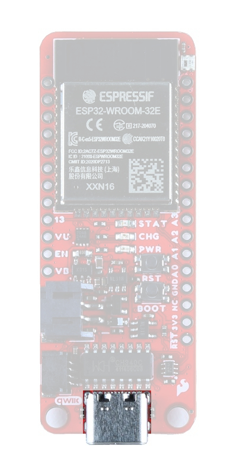{ width="200" }](./img/hookup_guide/usb_connector.jpg) 
*USB-C connector on the ESP32-WROOM Thing Plus. (Click to enlarge)*

### CH340 Serial-to-UART
The CH340 allows the ESP32-WROOM to communicate with a computer/host device through the board&apos;s USB-C connection. This allows the board to show up as a device on the serial (or COM) port of the computer. Users will need to install the latest drivers for the computer to recognize the board *(see [**Software Overview**](/SparkFun_Thing_Plus_ESP32_WROOM_C/software_overview/#ch340-driver) section)*.

## Power
The ESP32-WROOM Thing Plus only requires **3.3V** to power the board. However, the simplest method to power the board is through the USB-C connector. Alternatively, the `3V3`, `VBAT`, and `VUSB` pins can also be used to supply power to the board.

* `VUSB`:
    * The maximum voltage for the LDOs and charge controller is **6V**.
    * The minimum voltage for the charge controller is **3.75V**.
* `VBAT`:
    * Should not be connected to anything other than a single-cell LiPo battery.
* `3V3`:
    * Requires a **regulated 3.3V**.
    * Only powers the board and not the Qwiic connector.

[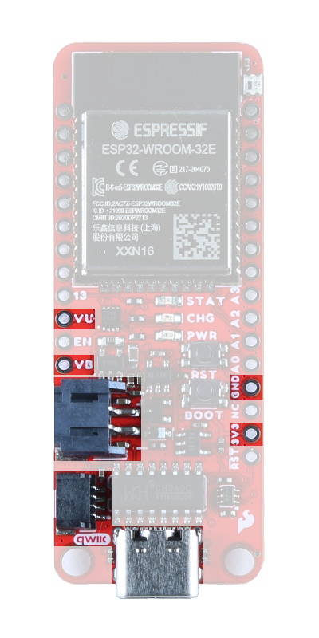{ width="200" }](./img/hookup_guide/power_connections2.jpg) 
*ESP32-WROOM Thing Plus power connections. (Click to enlarge)*

Below, is a general summary of the power circuitry on the board:

* **`3V3`** - Provides a regulated 3.3V from the USB (5V) power and/or battery connections.
    * Used to power the ESP32-WROOM module, &micro;SD card slot, WS2812 RGB LED, CH340C Serial-to-UART bridge, and power LED.
        * The Qwiic connector is powered by its own voltage regulator, from the same power source(s).
    * The **3.3V** [XC6222](./component_datasheets/XC6222.pdf) LDO regulator can source up to 700mA.
        * Output is controlled by the `EN` pin on the board.
* **`VUSB`** - The voltage from the USB-C connector, usually **5V**.
    * Power source for the entire board.
        * Powers the 3.3V voltage regulators and the battery charging circuit for `VBAT`.
    * Overides power from the battery through a P-channel MOSFET, when both are connected.
    * Utilizes a [BAT20J protection diode](./component_datasheets/BAT20J_datasheet.pdf) for the USB-C connection.
* **`VBAT`** - The voltage from the JST battery connector; meant for single cell LiPo batteries.
    * Provides power to the 3.3V voltage regulators and [MAX17048](./component_datasheets/MAX17048.pdf) battery fuel gauge.
    * The [MCP73831](./component_datasheets/MCP73831.pdf) linear charge management controller is powered from the USB (5V) power supply.
        * The charge controller is configured for **500mA** *(max)* rate of charge to a connected battery.
* **`GND`** - The common ground or the 0V reference for the voltage supplies.
* **Qwiic Connector** - Provides a regulated 3.3V voltage from the USB (5V) power and/or battery connections.
    * Operates independently from the `3V3` pin, with its own voltage regulator.
    * The **3.3V** [XC6222](./component_datasheets/XC6222.pdf) LDO regulator can source up to 700mA.
        * Output is controlled by `GPIO 0` of the ESP32-WROOM.

*For more details, users can reference the [schematic](./board_files/schematic.pdf) and the datasheets of the individual components in the power circuitry.*

### Power Status LED
The red, `PWR` LED will light up once **3.3V** is supplied to the board; however, for most users, it will light up when **5V** is supplied through the USB connection or when a LiPo battery is connected to the JST connector.

[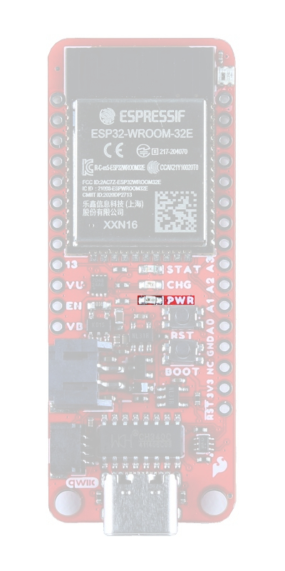{ width="200" }](./img/hookup_guide/LED_pwr.jpg) 
*ESP32-WROOM Thing Plus `PWR` status LED indicator. (Click to enlarge)*

### Charging Circuit
The charging circuit utilizes the [MCP73831 linear charge management controller](./component_datasheets/MCP73831.pdf) and is powered directly from the USB-C connector or `VUSB`. The controller is configured for a **500mA** charge rate and active charging is indicated by the yellow, `CHG` LED. If the charge controller is shutdown or charging is complete, the `CHG` LED will turn off. For more information, please refer to the [MCP73831 datasheet](./component_datasheets/MCP73831.pdf) and the **Indicator LEDs** section below.

### Power Control
The power source for the [XC6222 LDO voltage regulators](./component_datasheets/XC6222.pdf) is controlled by a P-channel MOSFET. In addition, the **3.3V** regulated output from the XC6222 LDOs are enabled by the control pin (`CE`).

    
[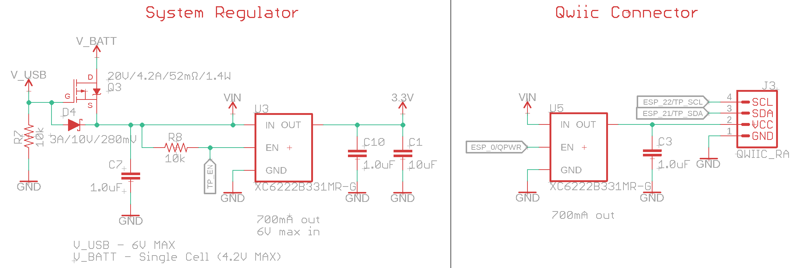{ width="200" }](./img/hookup_guide/power_control_circuits.png) 
*Circuits for the 3.3V power on the ESP32-WROOM Thing Plus. (Click to enlarge)*

The P-channel MOSFET operates based on the voltages at the MOSFET&apos;s gate and source pins. Depending on the power supplies connected to the board, the MOSFET will switch between the battery and USB-C connection as power sources for the XC6222 voltage regulators.

<table  style="font-size:12.25px;width:100%">
    <tr>
        <th rowspan="2" style="text-align:center; vertical-align:middle; min-width:1rem;">
            Power 
            Source
        </th>
        <th colspan="4" style="text-align:center; vertical-align:middle">MOSFET</th>
        <th rowspan="2" style="text-align:center; vertical-align:middle">Power Control Description</th>
    </tr>
    <tr>
        <th style="text-align:center; vertical-align:middle; min-width:1rem;" width="11.4%">Gate</th>
        <th style="text-align:center; vertical-align:middle; min-width:1rem;" width="14.8%">Source</th>
        <th style="text-align:center; min-width:1rem;" width="18.4%">
            VGS 
            (VGate - VSource)
        </th>
        <th style="text-align:center; min-width:1rem;" width="14.3%">
            MOSFET 
            Operation
        </th>
    </tr>
    <tr>
        <td style="vertical-align:middle" align="center">USB Only</td>
        <td style="vertical-align:middle" align="center">VUSB = 5V</td>
        <td style="vertical-align:middle" align="center">VUSB - Vf</td>
        <td style="vertical-align:middle" align="center">
            VUSB - (VUSB - Vf) 
            VGS = Vf
        </td>
        <td style="vertical-align:middle">
            MOSFET Off 
            RGS = &infin; 
            Switch Open
        </td>
        </td>
        <td>
            <b>Power to the XC6222 is supplied by the USC-C connection.</b> 
            Power from the USB-C connection is passed through the Schottky diode. Due to the voltage drop from the Schottky diode, the gate threshold voltage for the MOSFET is positive and equivalent to the diode's forward voltage (<b>Vf</b>).Therefore, the MOSFET behaves as an open switch.
        </td>
    </tr>
    <tr>
        <td style="vertical-align:middle" align="center">Battery Only</td>
        <td style="vertical-align:middle" align="center">VUSB = 0V</td>
        <td style="vertical-align:middle" align="center">
            <u>Dep. Mode</u>: 
            VSource = 0 
             
            <u>Charged Cap.</u>: 
            VBatt = 3 - 4.2V
        </td>
        <td style="vertical-align:middle" align="center">
            <u>Dep. Mode</u>: 
            VGS = 0 
             
            <u>Charged Cap.</u>: 
            VUSB - VBatt = -VBatt 
            -3V > VGS > -4.2V
        </td>
        <td style="vertical-align:middle">
            MOSFET On 
            RGS = Low 
            Switch Closed
        </td>
        <td>
            <b>Power to the XC6222 is supplied from the battery connection.</b> 
            As a depletion type P-channel MOSFET, the mosfet acts as a normally closed switch when the gate threshold voltage is zero. Therefore, power from the battery is able to charge the capacitor and create a negative gate threshold voltage. The MOSFET remains behaving as a closed switch and power to the XC6222 is provided from the battery.
        </td>
    </tr>
    </tr>
    <tr>
        <td style="vertical-align:middle" align="center">USB & Battery</td>
        <td style="vertical-align:middle" align="center">VUSB = 5V</td>
        <td style="vertical-align:middle" align="center">VUSB - Vf</td>
        <td style="vertical-align:middle" align="center">VGS = Vf</td>
        <td style="vertical-align:middle">
            MOSFET Off 
            RGS = &infin; 
            Switch Open
        </td>
        <td>
            <b>Power to the XC6222 is supplied by the USC-C connection.</b> 
            Power from the USB-C connection is passed through the Schottky diode. Due to the voltage drop from the Schottky diode, the gate threshold voltage for the MOSFET is positive and equivalent to the diode's forward voltage (<b>Vf</b>).Therefore, the MOSFET behaves as an open switch.
        </td>
    </tr>
</table>

The control pin (`CE`) of the XC6222 LDOs also provides an additional amount of control for the board's power. By default, the regulated 3.3V output is enabled. To disable and shutdown the output voltage from the XC6222, the control pin needs to be pulled low (i.e. shorted to ground (`GND`)). For more information, please refer to the [XC6222 datasheet](./component_datasheets/XC6222.pdf).

* The 3.3V power for the board (`3V3`) is controlled by the `EN` pin, which is broken out on the board.
* The 3.3V power for the Qwiic connector is controlled by `GPIO 0` of the ESP32-WROOM.

[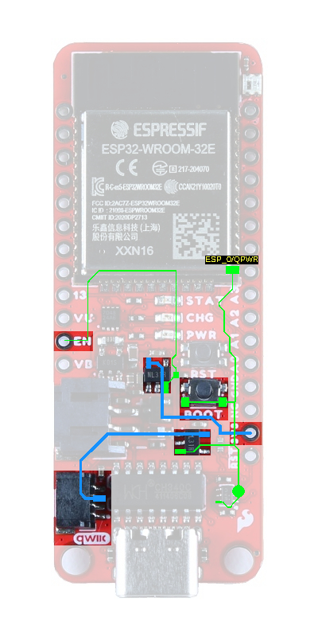{ width="200" }](./img/hookup_guide/power_control.jpg) 
*XC6222 control pins on the ESP32-WROOM Thing Plus. (Click to enlarge)*

!!! warning
    <b>&#9889; Note:</b> The <kbd>BOOT</kbd> button is also connected to <code>GPIO 0</code>. Therefore, pressing the <kbd>BOOT</kbd> button will momentarily disable power to the Qwiic connector.

### Current Consumption
According to the specifications, the ESP32-WROOM draws about **240 mA** during RF transmissions. With the WiFi example in this tutorial, have measured it to average around **140 mA** and peak at *300 mA* while actively transceiving. The table below, summarizes the approximate current draw of the [ESP32-WROOM Thing Plus (USB-C)](https://www.sparkfun.com/products/20168) for various operational conditions. The measurements in the table below, were made with the [Nordic Power Profiler Kit II](https://www.sparkfun.com/products/17816).

<table style="font-size:13.6px">
    <tr>
        <th rowspan="2" style="vertical-align:middle; text-align:center">Operation</th>
        <th colspan="4" style="text-align:center">Avg. Current Draw</th>
    </tr>
    <tr>
        <td style="text-align:center">
            LiPo: <b>3.5V</b> 
            <i>(Low < 5%)</i>
        </td>
        <td style="text-align:center">
            LiPo: <b>3.7V</b> 
            <i>(~15%)</i>
        </td>
        <td style="text-align:center">
            LiPo: <b>4.2V</b> 
            <i>(~100%)</i>
        </td>
        <td style="text-align:center; vertical-align:middle">
            USB-C: <b>5V</b> 
            <i>(No Battery)</i>
        </td>
    </tr>
    <tr>
        <th style="vertical-align:middle">Idle (Blank Code)</th>
        <td style="vertical-align:middle; text-align:center;">
            63 mA 
            <i>86 mA (peak)</i>
        </td>
        <td style="vertical-align:middle; text-align:center;">
            63.5 mA 
            <i>89 mA (peak)</i>
        </td>
        <td style="vertical-align:middle; text-align:center;">
            64 mA 
            <i>88.6 mA (peak)</i>
        </td>
        <td style="vertical-align:middle; text-align:center;">
            67 mA 
            <i>89.9 mA (peak)</i>
        </td>
    </tr>
    <tr>
        <th style="vertical-align:middle">Idle: USB + Battery Power</th>
        <td style="vertical-align:middle; text-align:center;">
            --
        </td>
        <td style="vertical-align:middle; text-align:center;">
            --
        </td>
        <td style="vertical-align:middle; text-align:center;">
            90.5 &micro;A 
            <i>721 &micro;A (peak)</i>
        </td>
        <td style="vertical-align:middle; text-align:center;">
            N/A
        </td>
    </tr>
    <tr>
        <th style="vertical-align:middle">
            Idle: Battery Charging 
            <i>(Current from USB-C)</i>
        </th>
        <td style="vertical-align:middle; text-align:center;">
            395 mA 
            <i>420 mA (peak)</i>
        </td>
        <td style="vertical-align:middle; text-align:center;">
            590 mA 
            <i>600 mA (peak)</i>
        </td>
        <td style="vertical-align:middle; text-align:center;">
            &gt; 110 mA 
            <i>(before shutdown)</i>
        </td>
        <td style="vertical-align:middle; text-align:center;">
            N/A
        </td>
    </tr>
    <tr>
        <th style="vertical-align:middle">RGB <i>(White @ 100%)</i></th>
        <td style="vertical-align:middle; text-align:center;">
            78.4 mA 
            <i>105.9 mA (peak)</i>
        </td>
        <td style="vertical-align:middle; text-align:center;">
            79 mA 
            <i>106.8 mA (peak)</i>
        </td>
        <td style="vertical-align:middle; text-align:center;">
            79.9 mA 
            <i>105.3 mA (peak)</i>
        </td>
        <td style="vertical-align:middle; text-align:center;">
            82.5 mA 
            <i>108.2 mA (peak)</i>
        </td>
    </tr>
    <tr>
        <th style="vertical-align:middle">
            WiFi Example 
            <i>(Transceiving)</i>
        </th>
        <td style="vertical-align:middle; text-align:center;">
            135 mA 
            <i>295 mA (peak)</i>
        </td>
        <td style="vertical-align:middle; text-align:center;">
            137 mA 
            <i>310 mA (peak)</i>
        </td>
        <td style="vertical-align:middle; text-align:center;">
            137 mA 
            <i>307 mA (peak)</i>
        </td>
        <td style="vertical-align:middle; text-align:center;">
            140 mA 
            <i>300 mA (peak)</i>
        </td>
    </tr>
    <tr>
        <th style="vertical-align:middle">
            <a href="https://github.com/espressif/arduino-esp32/blob/master/libraries/ESP32/examples/DeepSleep/TouchWakeUp/TouchWakeUp.ino">Deep Sleep Example</a> 
            <i>(MCU Inactive)</i>
        </th>
        <td style="vertical-align:middle; text-align:center;">
            2.5 mA 
            <i>2.95 mA (peak)</i>
        </td>
        <td style="vertical-align:middle; text-align:center;">
            2.5 mA 
            <i>3 mA (peak)</i>
        </td>
        <td style="vertical-align:middle; text-align:center;">
            2.55 mA 
            <i>3 mA (peak)</i>
        </td>
        <td style="vertical-align:middle; text-align:center;">
            2.85 mA 
            <i>3.3 mA (peak)</i>
        </td>
    </tr>
    <tr>
        <th style="vertical-align:middle">
            <a href="https://github.com/espressif/arduino-esp32/blob/master/libraries/ESP32/examples/DeepSleep/TouchWakeUp/TouchWakeUp.ino">Deep Sleep Example</a> 
            <i>(MCU Inactive + Jumpers Cut)</i>
        </th>
        <td style="vertical-align:middle; text-align:center;">
            842 &micro;A 
            <i>1.24 mA (peak)</i>
        </td>
        <td style="vertical-align:middle; text-align:center;">
            848 &micro;A 
            <i>1.23 mA (peak)</i>
        </td>
        <td style="vertical-align:middle; text-align:center;">
            866 &micro;A 
            <i>1.24 mA (peak)</i>
        </td>
        <td style="vertical-align:middle; text-align:center;">
            1.19 mA 
            <i>1.58 mA (peak)</i>
        </td>
    </tr>
</table>

It is possible for users to reach sub-mA power consumption levels with the deep sleep power modes. Using the [`TimerWakeUp` Deep Sleep example code](https://github.com/espressif/arduino-esp32/blob/master/libraries/ESP32/examples/DeepSleep/TimerWakeUp/TimerWakeUp.ino), the LED jumpers cut, and powering the board through the LiPo battery connection we measured a power consumption of **845 &micro;A** *(990 &micro;A peak)* @ **3.7V** while the MCU was inactive.

[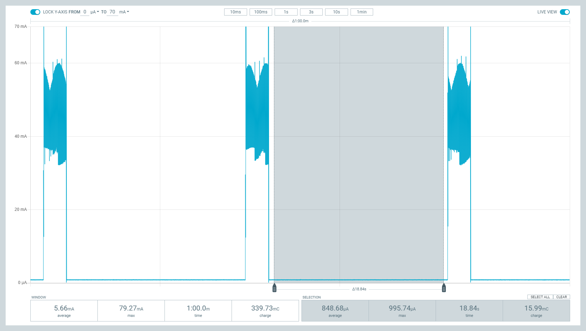{ width="200" }](./img/charge_profiles/measurement-ulp-from_batt.png) 
_The current measurement from `VBAT` at **3.7V** during deep sleep. (Click to enlarge)_

## ESP32-WROOM
This variant of the ESP32 Thing Plus is designed around the [ESP32-WROOM module](./component_datasheets/esp32-wroom-32e_datasheet_en.pdf) with 16MB of flash memory. Espressif&apos;s ESP32-WROOM module is a versitile, WiFi+BT+BLE MCU module that targets a wide variety of applications. At the core of this module is the ESP32-D0WDQ6 system on a chip (SoC) which is designed to be both scalable and adaptive. Its laundry list of features include:

<table>
    <tr>
        <td>
            <ul>
                <li>Xtensa® Dual-Core 32-bit LX6 Microprocessor <i>(up to 240MHz)</i></li>
                    <ul>
                        <li>448KB ROM and 520KB SRAM</li>
                        <li>16MB of Embedded SPI Flash Storage</li>
                    </ul>
                <li>Cryptographic Hardware Accelerators</li>
                    <ul>
                        <li>AES, SHA2, ECC, RSA-4096</li>
                    </ul>
                <li>Integrated 802.11 b/g/n WiFi 2.4GHz Transceiver <i>(up to 150Mbps)</i></li>
                <li>Integrated dual-mode Bluetooth (Bluetooth v4.2 and BLE) </li>
                <li>26 GPIO <i>(including strapping pins)</i></li>
                    <ul>
                        <li>8x Capacitive Touch Electrodes</li>
                    </ul>
                <li>Operating Voltage: <b>3.0 to 3.6V</b></li>
                    <ul>
                        <li>WiFi: 380mA <i>(peak)</i></li>
                    <li>Light-Sleep: 800&micro;A</li>
                        <li>Deep-Sleep: 10 - 150&micro;A</li>
                    </ul>
            </ul>
        </td>
        <td align="center">
             
            <i>ESP32-WROOM module on the ESP32 Thing Plus (USB-C). 
            (Click to enlarge)</i>
        </td>
    <tr>
</table>

!!! warning
    
Users should be aware of the following nuances and details of this board

    <ul>
        <li>The ESP32-WROOM is only compatible with <b>2.4GHz WiFi</b> networks; it will not work on the 5GHz bands.</li>
        <li>For details on the boot mode configuration, please refer to <a href="./component_datasheets/esp32-wroom-32e_datasheet_en.pdf#8">section <b>3.3 Strapping Pins</b></a> of the ESP32-WROOM module datasheet.</li>
    </ul>

!!! note
    
The ESP32-WROOM module has various power modes:

    <ul>
        <li><b>Active</b> -  The chip radio is powered on. The chip can receive, transmit, or listen.</li>
        <li><b>Modem Sleep</b> - The CPU is operational and the clock is configurable. The Wi-Fi/Bluetooth
    baseband and radio are disabled.</li>
        <li><b>Light Sleep</b> - The CPU is paused. The RTC memory and RTC peripherals, as well as the ULP
    coprocessor are running.</li>
        <li><b>Deep Sleep</b> - Only the RTC memory and RTC peripherals are powered on. The ULP coprocessor is functional.
        <li><b>Hibernation</b> - Only one RTC timer on the slow clock and certain RTC GPIOs are
    active.</li>
        <li><b>Off</b> - Chip is powered off</li>
    </ul>
    
    
<i>For more information on the power management of the ESP32-WROOM module, pleaser refer to <b>Section 3.7</b> and <b>Tables: 8 and 17</b> of the <a href="./component_datasheets/esp32_soc_datasheet_en.pdf">ESP32 SoC Datasheet</a>.</i>

### Debugging
For users interested in debugging their code, the <a href="https://docs.espressif.com/projects/esp-idf/en/latest/esp32/api-guides/jtag-debugging/configure-other-jtag.html#configure-hardware">JTAG pins</a> are broken out on the board. However, the debugging feature is only available through the <a href="https://docs.espressif.com/projects/esp-idf/en/latest/esp32/api-guides/jtag-debugging/index.html?highlight=jtag">ESP-IDF</a>.

* **`TMS`**: `GPIO 14`
* **`TDI`**: `GPIO 12`
* **`TCK`**: `GPIO 13`
* **`TDO`**: `GPIO 15`

!!! note
    Users should be aware that <code>GPIO 13</code> is connected to the <code>STAT</code> LED with a pull down resistor.

### Firmware Download Mode
Users can manually force the board into the <a href="https://docs.espressif.com/projects/esptool/en/latest/esp32/advanced-topics/boot-mode-selection.html#select-bootloader-mode">serial bootloader</a> with the <kbd>BOOT</kbd> button. Please, refer to the **Boot Button** section below for more information.

## Peripherals and I/O
!!! warning
    
<b>Note:</b> Users should be aware of the following nuances of this board
    <ul>
        <li>&#9889; All the GPIO on the ESP32-WROOM Thing Plus are <b>3.3V</b> pins.
            <ul>
                <li>The I/O pins are <strong>not 5V-tolerant</strong>! To interface with higher voltage components, a <a href="https://learn.sparkfun.com/tutorials/bi-directional-logic-level-converter-hookup-guide"><b>logic level adapter</b></a> is recommended.</li>
            </ul>
        </li>
        <li>&#9889;  There are electrical limitations to the amount of current that the ESP32-WROOM module can sink or source. For more details, check out the <a href="./component_datasheets/esp32-wroom-32e_datasheet_en.pdf">ESP32-WROOM module datasheet</a>.</li>
        <li>There are some limitations to the ADC performance, see the <b>Note</b> from the <a href="./component_datasheets/esp32_soc_datasheet_en.pdf"><b>ADC Characteristics</b> section of the ESP32 SoC datasheet</a>.
    </ul>

The ESP32-WROOM module has *26 multifunctional GPIO*, of which, **21 I/O pins** broken out into a feather form factor layout on this board. All of the [ESP32-WROOM Thing Plus (USB-C)](https://www.sparkfun.com/products/20168) pins have a .1&#x22; pitch spacing for headers. With the [pin multiplexing](https://docs.espressif.com/projects/arduino-esp32/en/latest/tutorials/io_mux.html?#id1) capabilities of the ESP32 SoC, various pins can have several functionalities. For more technical specifications on the **I/O** pins, please refer to the [ESP32 SoC datasheet](./component_datasheets/esp32_soc_datasheet_en.pdf).

* 13x 12-bit analog to digital converter (ADC) channels
* 3x UARTs (only two are configured by default in the Arduino IDE, one UART is used for bootloading/debug) 
* 3x SPI (only one is configured by default in the Arduino IDE)
* 2x I2C (only one is configured by default in the Arduino IDE)
* 2x I2S Audio
* 2x digital-to-analog converter (DAC) channels
* 16x 20-bit PWM outputs
* 8x Capacitive Touch Inputs

[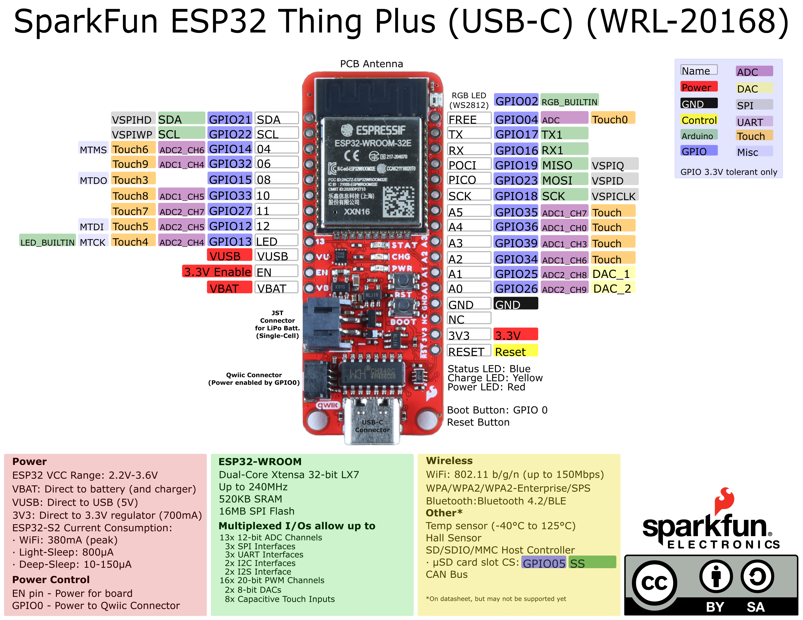{ width="500" }](./board_files/graphical_datasheet.pdf) 
*Graphical datasheet for the ESP32-WROOM Thing Plus (USB-C). (Click to enlarge)*

!!! note
    Users should be aware of the following limitations for the board in the Arduino IDE.
    <ul>
        <li>Not all of the features, listed above, are available in the Arduino IDE. For the full capabilities of the ESP32, the Espressif IDF should be utilized.</li>
        <li>Only one I2C bus is defined.</li>
        <li>Only two UART interfaces are available.</li>
        <ul>
            <li><b>UART (USB):</b> <code>Serial</code></li>
            <li><b><code>RX</code>/<code>TX</code> Pins:</b> <code>Serial1</code></li>
        </ul>
        <li>Only one SPI bus is defined.</li>
    </ul>

For digital pins, users will need to declare the [**`pinMode()`** *(link)*](https://www.arduino.cc/reference/en/language/functions/digital-io/pinmode/) in the setup of their <b>sketch</b> (programs written in the Arduino IDE) for the pins used.

#### Input
When configured properly, an <b>input</b> pin will be looking for a <b>HIGH</b> or <b>LOW</b> state. <b>Input</b> pins are <b>High Impedance</b> and takes very little current to move the input pin from one state to another.

#### Output
When configured as an <b>output</b> the pin will be at a <b>HIGH</b> or <b>LOW</b> voltage. <b>Output</b> pins are <b>Low Impedance</b>: This means that they can provide a relatively substantial amount of current to other circuits.

!!! warning
    <b>&#9889;</b> There are electrical limitations to the amount of current that the ESP32-WROOM module can sink or source. For more details, check out the <a href="./component_datasheets/esp32-wroom-32e_datasheet_en.pdf">ESP32-WROOM module datasheet</a>.

### Additional Functions
There are several pins that have special functionality in addition to general **digital I/O**. These pins and their additional functions are listed in the tabs below. For more technical specifications on the **I/O** pins, you can refer to the [schematic](./board_files/schematic.pdf), [ESP32-WROOM module datasheet](./component_datasheets/esp32-wroom-32e_datasheet_en.pdf), [ESP32 SoC datasheet](./component_datasheets/esp32_soc_datasheet_en.pdf), and [documentation for the ESP32 Arduino core](https://docs.espressif.com/projects/arduino-esp32/en/latest/tutorials/io_mux.html?#peripherals).

<!-- Tabs -->

    <ul class="nav nav-tabs" role="tablist" style="border-bottom-color:dimgrey">
        <li role="presentation" class="active">
        <a href="#Analog-Input-tab" aria-control="Digital-IO" role="tab" data-toggle="tab">
            Analog Input</a></li>
        <li role="presentation">
        <a href="#PWM-Output-tab" aria-control="Digital-IO" role="tab" data-toggle="tab">
            PWM/Analog Output</a></li>
        <li role="presentation">
        <a href="#Serial-tab" aria-control="Digital-IO" role="tab" data-toggle="tab">
            Serial Comm.</a></li>
        <li role="presentation">
        <a href="#SPI-tab" aria-control="Digital-IO" role="tab" data-toggle="tab">
            SPI</a></li>
        <li role="presentation">
        <a href="#I2C-tab" aria-control="Digital-IO" role="tab" data-toggle="tab">
            I2C</a></li>
    </ul>
<!--Analog Input Tab-->
    

        

            

<H4>Analog Input Pins</H4>

The ESP32-WROOM module provides a <b>12-bit ADC</b> input on thirteen of its I/O pins. This functionality is accessed in the Arduino IDE using the <a href="https://www.arduino.cc/reference/en/language/functions/analog-io/analogread/"><code>analogRead(pin)</code> function</a>. <i>(*The available ADC pins are highlighted in the image below.)</i>

    

        

            
             
            <i>Analog input pins on the ESP32-WROOM Thing Plus. (Click to enlarge)</i>
        

    

    

        

            <b>Note:</b> By default, in the Arduino IDE, <code>analogRead()</code> returns a 10-bit value. To change the resolution of the value returned by the <code>analogRead()</code> function, use the <a href="https://www.arduino.cc/reference/en/language/functions/zero-due-mkr-family/analogreadresolution/"><code>analogReadResolution(bits)</code> function</a>.
        

        

            
<b>Note:</b> To learn more about analog vs. digital signals, check out this great <a href="https://learn.sparkfun.com/tutorials/analog-vs-digital">tutorial</a>.

               
            <!-- tutorial_big(89) -->
        

    

            

        

<!--PWM Tab-->
        

            

<H4>Pulse Width Modulation (PWM) and Analog (DAC) Output Pins</H4>

The ESP32-WROOM module supports up to sixteen channels of <b>20-bit PWM</b> outputs on any of its I/O pins. This is accessed in the Arduino IDE using the <a href="https://www.arduino.cc/reference/en/language/functions/analog-io/analogwrite/"><code>analogWrite(pin, value)</code> function</a> or the <a href="https://espressif-docs.readthedocs-hosted.com/projects/arduino-esp32/en/latest/api/ledc.html">LED Control API</a>. <i>(*Any I/O pin can be used for the PWM outputs; the available DAC pins, with true analog outputs, are highlighted in the image below.)</i>

    

        

            
             
            <i>Any I/O pin can be used for a PWM output, but these are the DAC pins on the ESP32-WROOM Thing Plus. (Click to enlarge)</i>
        

    

    

        

            
<b>Note:</b> By default, in the Arduino IDE, <code>analogWrite()</code> accepts an 8-bit value. To change the resolution of the PWM signal for the <code>analogWrite()</code> function, use the <a href="https://www.arduino.cc/reference/en/language/functions/zero-due-mkr-family/analogwriteresolution/"><code>analogWriteResolution(bits)</code> function</a>.

            
<i>(*The PWM output is not a true analog signal. For a true analog output, please refer to the <a href="https://espressif-docs.readthedocs-hosted.com/projects/arduino-esp32/en/latest/api/dac.html">DAC API</a> for <code>GPIO 25</code> and <code>GPIO 26</code>.)</i>

        

        

            
<b>Note:</b> To learn more about pulse width modulation (PWM), check out this great <a href="https://learn.sparkfun.com/tutorials/pulse-width-modulation">tutorial</a>.

             
            <!-- tutorial_big(51) -->
        

    

            

        

<!--Serial Communication Tab-->
        

            

<H4>Serial Communication Pins</H4>

The ESP32-WROOM module provides three UART ports. By default, the UART port for the USB connection (<code>Serial</code>) and the labeled UART I/O pins on the board (<code>Serial1</code>) can be accessed through the Arduino IDE using the <a href="https://www.arduino.cc/reference/en/language/functions/communication/serial/">serial communication class</a>.

    

        

            
             
            <i>Default UART ports on the ESP32-WROOM Thing Plus. (Click to enlarge)</i>
        

    

    

        
<b>Note:</b> By default, in the Arduino IDE, the <b>SparkFun ESP32 Thing Plus C</b> board definition supports:        
        <ul>
            <li><code>Serial</code> - <b>UART (USB)</b></li>
            <li><code>Serial1</code> - <b>Pins: <code>RX</code>/<code>TX</code> (<code>GPIO 16</code>/<code>GPIO 17</code>)</b></li>
        </ul>
        In order to utilize the serial communication on the strapping pins, users will need to create a custom serial port object and declare which pins to access.

        

            
<b>Note:</b> To learn more about serial communication, check out this great <a href="https://learn.sparkfun.com/tutorials/serial-communication">tutorial</a>.

             
            <!-- tutorial_big(8) -->
        

    

    
<b>Note:</b> We have noticed that with the ESP32 Arduino core, <code>Serial.available()</code> does not operate instantaneously. This is due to an interrupt triggered by the UART, to empty the FIFO when the <b><code>RX</code></b> pin is inactive for two byte periods:
        <ul>
            <li>At 9600 baud, <code>hwAvailable</code> takes [<code>number of bytes received</code> + 2] x 1 ms = <b>11 ms</b> before the UART indicates that data was received from: <code>\r\nERROR\r\n</code>.</li>
            <li>At 115200 baud, <code>hwAvailable</code> takes [<code>number of bytes received</code> + 2] x .087 ms = <b>~1 ms</b> before the UART indicates that data was received from: <code>\r\nERROR\r\n</code>.</li>
        </ul>
    

    
<i>For more information, please refer to this <a href="https://gitter.im/espressif/arduino-esp32?at=5e25d6370a1cf54144909c85"> chatroom discussion</a>.</i>

            

        

<!--SPI Tab-->
        

            

<H4>SPI Communication</H4>

The ESP32-WROOM module provides three SPI buses. By default, in the Arduino IDE, the <a href="https://www.arduino.cc/en/reference/SPI">SPI class</a> is configured to utilize pins <code>GPIO 18</code> (SCK), <code>GPIO 19</code> (POCI), <code>GPIO 23</code> (PICO). These pins share the same SPI bus as the &micro;SD card slot, which utilizes pin <code>5</code> (<code>SS</code>) for its chip select. In order to utilize the other SPI ports or objects, users will need to create a custom SPI object and declare which pins to access.

<b>Note:</b> To comply with the latest <a href="https://www.oshwa.org/">OSHW</a> design practices, we have <a href="https://www.sparkfun.com/spi_signal_names">adopted the new SPI signal nomenclature</a> (<b>SDO</b>/<b>SDI</b> and <b>PICO</b>/<b>POCI</b>). The terms Master and Slave are now referred to as Controller and Peripheral. The <code>MOSI</code> signal on a controller has been replaced with <code>SDO</code> or <code>PICO</code>. Please refer to this <a href="https://www.oshwa.org/a-resolution-to-redefine-spi-signal-names">announcement on the decision to deprecate the <b>MOSI</b>/<b>MISO</b> terminology and transition to the <b>SDO</b>/<b>SDI</b> naming convention</a>.

    

        

            
             
            <i>Default SPI bus connections on the ESP32-WROOM Thing Plus.</i> (Click to enlarge)</i>
        

    

    

        

            <table>
                <tr>
                    <th style="text-align:center">SCK</th>
                    <td style="text-align:center"><code>GPIO 18</code> (<code>SCK</code>)</td>
                </tr>
                <tr>
                    <th style="text-align:center">SDI or POCI</th>
                    <td style="text-align:center"><code>GPIO 19</code> (<code>MISO</code>)</td>
                </tr>
                <tr>
                    <th style="text-align:center">SDO or PICO</th>
                    <td style="text-align:center"><code>GPIO 23</code> (<code>MOSI</code>)</td>
                </tr>
                <tr>
                    <th style="text-align:center">CS (&micro;SD Card)</th>
                    <td style="text-align:center"><code>GPIO 5</code> (<code>SS</code>)</td>
                </tr>
            </table>
        

        

            
<b>Note:</b> To learn more about the serial peripheral interface (SPI) protocol, check out this great <a href="https://learn.sparkfun.com/tutorials/serial-peripheral-interface-spi">tutorial</a>.

             
            <!-- tutorial_big(16) -->
        

    

            

        

<!--I2C Tab-->
        

            

<H4>I2C Communication Pins</H4>

The ESP32-WROOM module module can support up to two I2C buses. By default, in the Arduino IDE, the <a href="https://www.arduino.cc/en/reference/wire">Wire class</a> is configured to utilize pins <code>GPIO 21</code> (SDA) and <code>GPIO 22</code> (SCL). These pins share the same I2C bus with the Qwiic connector and MAX17048 fuel gauge. In order to utilize the other  I2C ports, users will need to create a custom Wire object and declare which pins to access.

        

            <a href="https://github.com/sparkfun/SparkFun_Thing_Plus_ESP32_WROOM_C/docs/img/hookup_guide/I2C_connections.jpg">2C pins" src="https://github.com/sparkfun/SparkFun_Thing_Plus_ESP32_WROOM_C/docs/img/hookup_guide/I2C_connections.jpg"></a>
             
            <i>Default I2C bus connections for the ESP32-WROOM Thing Plus.</i> (Click to enlarge)</i>
        

    

    

        

            <table>
                <tr>
                    <th style="text-align:center">SCL</th>
                    <td  style="text-align:center"><code>GPIO 22</code> (<code>SCL</code>)</td>
                </tr>
                <tr>
                    <th style="text-align:center">SDA</th>
                    <td style="text-align:center"><code>GPIO 21</code> (<code>SDA</code>)</td>
                </tr>
            </table>
        

        

            
<b>Note:</b> To learn more about the inter-integrated circuit (I2C) protocol, check out this great <a href="https://learn.sparkfun.com/tutorials/i2c">tutorial</a>.

             
            <!-- tutorial_big(82) -->
        

    

            

        

    

## Buttons
There are two buttons on ESP32-WROOM Thing Plus; a <kbd>RST</kbd> and <kbd>BOOT</kbd> button.

### Reset Button
The <kbd>RST</kbd> *(reset)* button allows users to reset the program running on the ESP32-WROOM module without unplugging the board.

[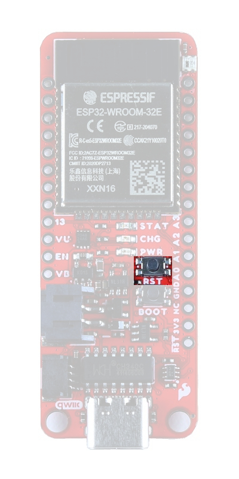{ width="200" }](./img/hookup_guide/button_reset.jpg) 
*<kbd>RST</kbd> button on the ESP32-WROOM Thing Plus. (Click to enlarge)*

### Boot Button
The <kbd>BOOT</kbd> button can be used to force the board into the serial bootloader. Holding down the <kbd>BOOT</kbd> button, while connecting the board to a computer through its USB-C connector or resetting the board will cause it to enter the <a href="https://docs.espressif.com/projects/esptool/en/latest/esp32/advanced-topics/boot-mode-selection.html#manual-bootloader">Firmware Download mode</a>. The board will remain in this mode until it power cycles (happens automatically after uploading new firmware) or the <kbd>RST</kbd> button is pressed.

1. Hold the <kbd>BOOT</kbd> button down.
2. Reset the MCU.
    * While unpowered, connect the board to a computer with through the USB-C connection.
    * While powered, press the <kbd>RST</kbd> button.
3. Release the <kbd>BOOT</kbd> button.
4. After programming is completed, reboot the MCU.
    * Press the <kbd>RST</kbd> button.
    * Power cycle the board. 

[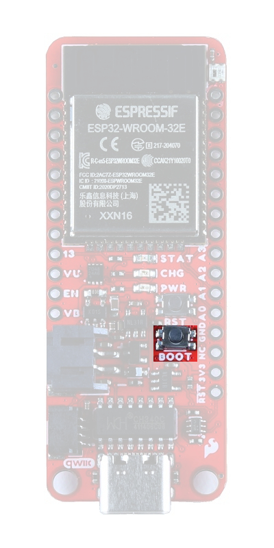{ width="200" }](./img/hookup_guide/button_boot.jpg) 
*<kbd>BOOT</kbd> button on the ESP32-WROOM Thing Plus. (Click to enlarge)*

!!! warning
    <b>&#9889;</b> The <kbd>BOOT</kbd> button is also connected to <code>GPIO 0</code>, which controls the voltage output to the Qwiic connector. Therefore, pressing the <kbd>BOOT</kbd> button will momentarily disable power to the Qwiic connector.

## Indicator LEDs
There are four indicator LEDs on the ESP32-WROOM Thing Plus:

* **`PWR`:** Power (Red)
* **`CHG`:** Battery Charging (Yellow)
* **`13`:** `GPIO 13` (Blue)
* **`WS2812`:** `GPIO 02` (RGB)

### Power LED
The red, power (`PWR`) LED will light up once **3.3V** is supplied to the board. For most users, it will light up when **5V** is supplied through the USB connection and/or when a LiPo battery is attached to the JST connector. 

[{ width="200" }](./img/hookup_guide/LED_pwr.jpg) 
*ESP32-WROOM Thing Plus `PWR` status LED indicator. (Click to enlarge)*

### Battery Charging LED
The yellow, battery charging (`CHG`) LED indicates the status of the MCP73831 charge management controller. The LED will shut off when no battery is present, when the charge management controller is in standby (*after the battery charging has been completed*), or when the charge management controller is shutdown. The LED will illuminate when the charge management controller is in the process of charging the battery. For more information, please refer to the [MCP73831 datasheet](./component_datasheets/MCP73831.pdf).

<table style="width:100%">
    <tr>
        <td align="center">
             
            <i>The battery charging (<code>CHG</code>) LED indicator on the ESP32-WROOM Thing Plus. (Click to enlarge)</i>
        </td>
        <td align="center" width="50%">
            <table>
                <tr>
                    <th style="text-align:center">Charge Cycle State</th>
                    <th style="text-align:center">STAT1</th>
                </tr>
                <tr>
                    <td>
                        Shutdown
                        <ul>
                            <li>Thermal Shutdown</li>
                            <li>VDD < VBAT</li>
                        </ul>
                    </td>
                    <td align="center" style="vertical-align:middle"><b>Off</b> (High Z)</td>
                </tr>
                <tr>
                    <td>No Battery Present</td>
                    <td align="center"><b>Off</b> (High Z)</td>
                </tr>
                <tr>
                    <td>Charge Complete – Standby</td>
                    <td align="center"><b>Off</b> (H)</td>
                </tr>
                <tr>
                    <td>Preconditioning</td>
                    <td align="center"><b>On</b> (L)</td>
                </tr>
                <tr>
                    <td>Constant-Current Fast Charge</td>
                    <td align="center"><b>On</b> (L)</td>
                </tr>
                <tr>
                    <td>Constant Voltage</td>
                    <td align="center"><b>On</b> (L)</td>
                </tr>
            </table>
        </td>
    </tr>
</table>

### STAT LED
The blue, status (`STAT`) LED is typically used as a test or status LED to make sure that a board is working or for basic debugging. This indicator is connected to `GPIO 13`.

[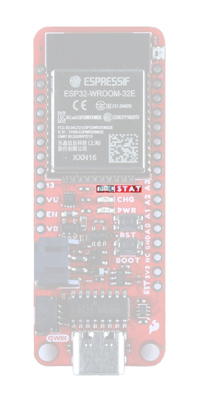{ width="200" }](./img/hookup_guide/LED_stat.jpg) 
*The status (`STAT`) LED indicator on the ESP32-WROOM Thing Plus. (Click to enlarge)*

### WS2812 RGB LED
The WS2812 RGB LED is controlled with a 24-bit (GRB) data signal. This indicator is connected to `GPIO 02` and the digital output pin from the LED is available through a test point. For more information, please refer to the [WS2812C datasheet](./component_datasheets/WS2812C-2020.pdf).

[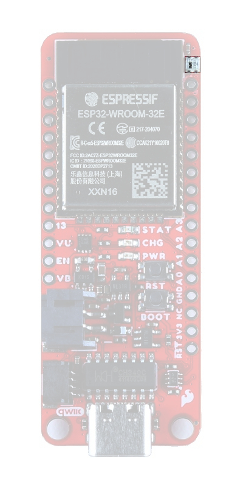{ width="200" }](./img/hookup_guide/LED_WS2812.jpg) 
*`WS2812` LED indicator on the ESP32-WROOM Thing Plus. (Click to enlarge)*

!!! note
    The latest ESP32 Arduino core, now provides a basic RGB LED driver for a WS2812 <i>(or NeoPixel)</i> LED populated the board. For an example of how to utilize the RGB LED driver check out the <a href="https://github.com/espressif/arduino-esp32/blob/master/libraries/ESP32/examples/GPIO/BlinkRGB/BlinkRGB.ino">BlinkRGB example code</a>, which can be accessed from the File drop down menu <i>(i.e <b>File</b> > <b>Examples</b> > <b>ESP32</b> > <b>GPIO</b> > <b>BlinkRGB</b>)</i>.

## &micro;SD Slot

!!! note
    To comply with the latest <a href="https://www.oshwa.org/">OSHW</a> design practices, we have <a href="https://www.sparkfun.com/spi_signal_names">adopted the new SPI signal nomenclature</a> (<b>SDO</b>/<b>SDI</b> and <b>PICO</b>/<b>POCI</b>). The terms Master and Slave are now referred to as Controller and Peripheral. Please refer to this <a href="https://www.oshwa.org/a-resolution-to-redefine-spi-signal-names">announcement on the decision to transition to the new naming convention</a>.

The [ESP32-WROOM Thing Plus (USB-C)](https://www.sparkfun.com/products/20168) includes an &micro;SD card slot. This is great for data logging applications or storing files. The &micro;SD card slot is connected to the following dedicated GPIO:

* **`GPIO 5`**: `DATA 3`/`CS`
* **`N/A`**: `DATA 2`
* **`N/A`**: `DATA 1`
* **`GPIO 19`**: `DATA 0`/`POCI` (or Peripheral's `SDO`)
* **`GPIO 18`**: `CLK`/`SCK`
* **`GPIO 23`**: `CMD`/`PICO` (or Peripheral's `SDI`)

[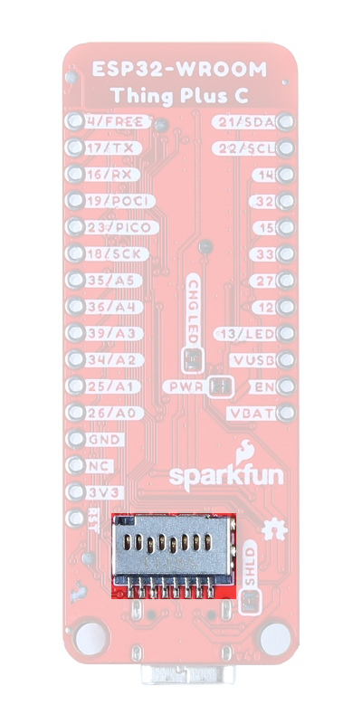{ width="200" }](./img/hookup_guide/SD_card_slot.jpg) 
*&micro;SD card slot on the ESP32-WROOM Thing Plus. (Click to enlarge)*

## Jumpers
There are two jumpers on the back of the board that can be used to easily modify the hardware connections on the board.

* **SHLD** - This jumper can be used to disconnect the USB shield from `GND`.
* **PWR** - This jumper can be used to remove power to the `PWR` LED. 
* **CHG LED** - This jumper can be used to remove power to the `CHG` LED.
    * Avoid cutting the box&apos;s silkscreen; there are traces under it:
    

    [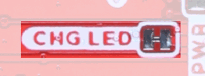{ width="200" }](./img/hookup_guide/jumper_caution.gif) 
    *Traces around the **`CHG LED`** jumper. (Click to enlarge)*
    

!!! note
    
Never modified a jumper before? Check out our <a href="https://learn.sparkfun.com/tutorials/664">Jumper Pads and PCB Traces tutorial</a> for a quick introduction!

    

        <a href="https://learn.sparkfun.com/tutorials/664">How to Work with Jumper Pads and PCB Traces 
        </a>
    

[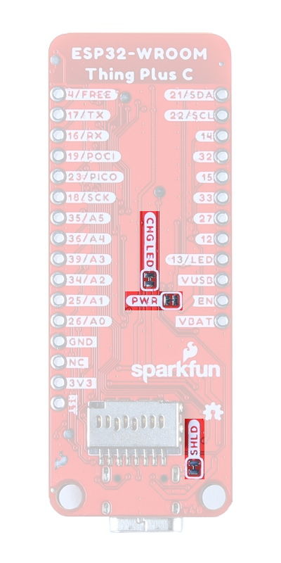{ width="200" }](./img/hookup_guide/jumpers.jpg) 
*The jumpers on the back of the ESP32-WROOM Thing Plus. (Click to enlarge)*

## Primary I2C Bus
The Qwiic connector and battery fuel gauge are attached to the primary I2C bus. The primary I2C bus for this board utilizes the pin connections, detailed in the table below:

    <table>
        <tr>
            <th style="text-align:center">
                Connection
            </th>
            <td align="center"><code>VDD</code></td>
            <td align="center"><code>GND</code></td>
            <td align="center"><code>SCL</code></td>
            <td align="center"><code>SDA</code></td>
        </tr>
        <tr>
            <th style="text-align:center; vertical-align:middle">
                Battery Fuel Gauge 
                <i>(MAX17048)</i>
            </th>
            <td style="text-align:center; vertical-align:middle"><code>VBAT</code></td>
            <td style="text-align:center; vertical-align:middle"><b>GND</b></td>
            <td style="text-align:center; vertical-align:middle"><code>GPIO 22</code></td>
            <td style="text-align:center; vertical-align:middle"><code>GPIO 21</code></td>
        </tr>
        <tr>
            <th style="text-align:center; vertical-align:middle">
                Qwiic Connector
            </th>
            <td style="text-align:center; vertical-align:middle">
                <code>GPIO 0</code> 
                <i>(Enables 3.3V)</i>
            </td>
            <td style="text-align:center; vertical-align:middle"><b>GND</b></td>
            <td style="text-align:center; vertical-align:middle"><code>GPIO 22</code></td>
            <td style="text-align:center; vertical-align:middle"><code>GPIO 21</code></td>
        </tr>
    </table>

### Battery Fuel Gauge
The [MAX17048 fuel gauge](./component_datasheets/MAX17048.pdf) measures the approximate charge or discharge rate, state of charge (SOC) (based on ModelGauge algorithm), and voltage of a connected battery. Additionally, the chip is powered directly from `VBAT`, when a LiPo battery is connected. For more information, please refer to the [MAX17048 datasheet](./component_datasheets/MAX17048.pdf).

<table>
    <tr>
        <td>
             
            <i>The MAX17048 fuel gauge on the ESP32-WROOM Thing Plus. (Click to enlarge)</i>
        </td>
        <td>
            <table>
                <tr>
                    <td>I2C Address</td>
                    <td>
                        <b>0x36</b> (7-bit) 
                        <b>0x6C</b> (write)/<b>0x6D</b> (read)
                    </td>
                </tr>
                <tr>
                    <td>Voltage Measurement</td>
                    <td>
                        Range: 2.5 - 5 V 
                        Precision: &PlusMinus;7.5 mV/Cell 
                        Resolution 1.25 mV/Cell
                    </td>
                </tr>
                <tr>
                    <td>Current Consumption</td>
                    <td>
                        Sleep: .5 - 2 µA 
                        Hibernate: 3 - 5 µA 
                        Active: 23 - 40 µA
                    </td>
                </tr>
            </table>
        </td>
    </tr>
</table>

!!! note
    The <code>Alert</code> pin for the MAX17048 is not connected and cannot be utilized.

### Qwiic Connector
A Qwiic connector is provided for users to seamlessly integrate with <a href="https://www.sparkfun.com/qwiic">SparkFun's Qwiic Ecosystem</a>.

[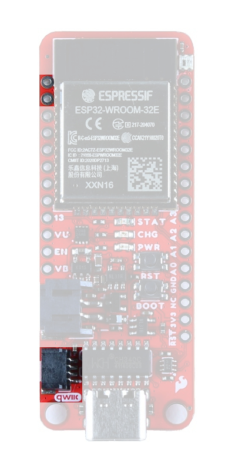{ width="200" }](./img/hookup_guide/I2C_connections.jpg) 
*Qwiic connector and I2C pins on the ESP32-WROOM Thing Plus. (Click to enlarge)*

#### Power Control
In order to enable power for the Qwiic connector, users must toggle <code>GPIO 0</code> high. This enables the power output from the XC6222 LDO regulator to the Qwiic connector, which can sources up to **700mA** at **3.3V** . In order to conserve battery power or in low power applications, users will can toggle <code>GPIO 0</code> low, to disable the power to the Qwiic connector.

!!! warning
    <b>&#9889;</b> <code>GPIO 0</code> is also connected to the <kbd>BOOT</kbd> button. Therefore, pressing the <kbd>BOOT</kbd> button will momentarily disable power to the Qwiic connector.

**What is Qwiic?**

The Qwiic system is intended a quick, hassle-free cabling/connector system for I2C devices. Qwiic is actually a play on words between "quick" and I2C or "iic".
 
 

<!-- youtube(https://youtu.be/x0RDEHqFIF8) -->

<H4>Features of the Qwiic System</H4>

    <ul class="nav nav-tabs" role="tablist" style="border-bottom-color:dimgrey">
        <li role="presentation" class="active">
        <a href="#Soldering-tab" aria-control="Soldering-tab" role="tab" data-toggle="tab">
            No Soldering</a></li>
        <li role="presentation">
        <a href="#Connector-tab" aria-control="Connector-tab" role="tab" data-toggle="tab">
            Polarized Connector</a></li>
        <li role="presentation">
        <a href="#Daisy-tab" aria-control="Daisy-tab" role="tab" data-toggle="tab">
            Daisy Chain</a></li>
    </ul>
    

        

            

              <h4 style="margin-bottom:10px;">Keep your soldering iron at bay.</h4>
            

            

              
Cables plug easily between boards making quick work of setting up a new prototype. We currently offer three different lengths of Qwiic cables as well as a breadboard friendly cable to connect any Qwiic enabled board to anything else. Initially you may need to solder headers onto the shield to connect your platform to the Qwiic system but once that’s done it’s plug and go!

            

            
 
              
Qwiic cables connected to <a href="https://www.sparkfun.com/products/14347">Spectral Sensor Breakout</a>

            

        

        

        

            

              <h4 style="margin-bottom:10px;">Minimize your mistakes.</h4>
            

            

              
How many times have you swapped the SDA and SCL wires on your breadboard hoping the sensor will start working? The Qwiic connector is polarized so you know you’ll have it wired correctly, every time, from the start.

              
The PCB connector is part number SM04B-SRSS (<a href="https://cdn.sparkfun.com/assets/parts/1/2/2/8/9/Qwiic_Connector_Datasheet.pdf">Datasheet</a>) or equivalent. The mating connector used on cables is part number SHR04V-S-B or equivalent. This is a common and low cost connector.

            

            
 
              
1mm pitch, 4-pin JST connector

            

        

        

        

            

              <h4 style="margin-bottom:10px;">Expand with ease.</h4>
            

            

              
It’s time to leverage the power of the I2C bus! Most Qwiic boards will have two or more connectors on them allowing multiple devices to be connected.

            

            
 
              
Shown above: <a href="https://www.sparkfun.com/products/14352">Qwiic Shield for Arduino</a> on <a href="https://www.sparkfun.com/products/13975">RedBoard</a>, <a href="https://www.sparkfun.com/products/14351">Spectral Sensor Breakout - NIR</a>, <a href="https://www.sparkfun.com/products/14347">Spectral Sensor Breakout - Visible</a> and <a href="https://www.sparkfun.com/products/14414">SparkFun GPS Breakout</a>
     

            

        

        

    
  

