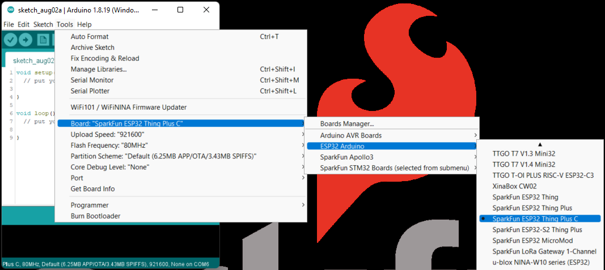

### CH340 Driver
Users will need to install the appropriate driver for their computer to recognize the serial-to-UART chip on their board/adapter. Most of the latest operating systems will recognize CH340C chip on the board and automatically install the required driver.

*To manually install the CH340 driver on their computer, users can download it from the [WCH website](http://www.wch-ic.com/products/CH340.html?). For more information, check out our [How to Install CH340 Drivers Tutorial](https://www.sparkfun.com/ch340).*

 
[**How to Install CH340 Drivers**](https://learn.sparkfun.com/tutorials/908)

### Arduino IDE
!!! note
    For first-time users, who have never programmed before and are looking to use the Arduino IDE, we recommend beginning with the <a href="https://www.sparkfun.com/products/15631">SparkFun Inventor's Kit (SIK)</a>, which includes a simpler board like the <a href="https://www.sparkfun.com/products/11224">Arduino Uno</a> or <a href="https://www.sparkfun.com/products/15123">SparkFun RedBoard</a> and is designed to help users get started programming with the Arduino IDE.

Most users may already be familiar with the Arduino IDE and it's use. However, for those of you who have never heard the name *Arduino* before, feel free to check out the [Arduino website](https://www.arduino.cc/en/Guide/HomePage). To get started with using the Arduino IDE, check out our tutorials below:

<table style="border-style:none">
    <tr>
        <td align="center">
            <a class="thumb" href="https://learn.sparkfun.com/tutorials/50">
                

                

                <h3 class="title">What is an Arduino?</h3>
            </a>
        </td>
        <td align="center">
            <a class="thumb" href="https://learn.sparkfun.com/tutorials/61">
                

                

                <h3 class="title">Installing Arduino IDE</h3>
            </a>
        </td>
        <td align="center">
            <a class="thumb" href="https://learn.sparkfun.com/tutorials/15">
                

                

                <h3 class="title">Installing an Arduino Library</h3>
            </a>
        </td>
        <td align="center">
            <a class="thumb" href="https://learn.sparkfun.com/tutorials/1265">
                

                

                <h3 class="title">Installing Board Definitions in the Arduino IDE</h3>
            </a>
        </td>
    </tr>
</table>

#### Install Board Definition
Install the latest <b>ESP32</b> board definitions in the Arduino IDE.

 
[**Installing Board Definitions in the Arduino IDE**](https://learn.sparkfun.com/tutorials/1265)

<figure markdown>
  [{ width=" 500" }](https://learn.sparkfun.com/tutorials/1265)
  <figcaption>[**Installing Board Definitions in the Arduino IDE**](https://learn.sparkfun.com/tutorials/1265)</figcaption>
</figure>

!!! note
    
For more instructions, users can follow this tutorial on <a href="https://docs.arduino.cc/learn/starting-guide/cores">Installing Additional Cores</a> provided by Arduino. Users will also need the <code>.json</code> file for the Espressif Arduino core:

    

        <a href="https://raw.githubusercontent.com/espressif/arduino-esp32/gh-pages/package_esp32_index.json"><code>https://raw.githubusercontent.com/espressif/arduino-esp32/gh-pages/package_esp32_index.json</code></a>
    

When selecting a board to program in the Arduino IDE, users should select the **SparkFun ESP32 Thing Plus C** from the Tools drop down menu *(i.e. **Tools** > **Board** > **ESP32 Arduino** > **SparkFun ESP32 Thing Plus C**).* Alternatively, users can also select the **ESP32 Dev Module**; however, they may loose some pin assignments (i.e. `LED_BUILTIN`).

[{ width=" 300" }](./img/hookup_guide/board_selection.png) 
*Selecting the **SparkFun ESP32 Thing Plus C** from the Tools drop down menu in the Arduino IDE. (Click to enlarge)*

<figure markdown>
  { width="300" }
  <figcaption>Image caption</figcaption>
</figure>

<figure markdown>
  
  <figcaption>Selecting the **SparkFun ESP32 Thing Plus C** from the Tools drop down menu in the Arduino IDE. (Click to enlarge)</figcaption>
</figure>